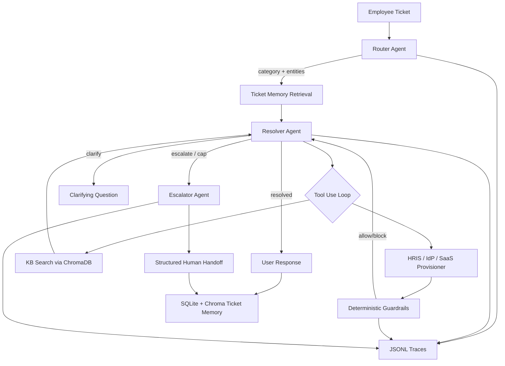

# DeskPilot Lite

Autonomous IT/HR helpdesk triage and resolution for internal operations.

**[Live Demo →](https://projects-dev-h3f2z6n2klftxzm3zpywrk.streamlit.app/)**

DeskPilot Lite is a runnable multi-agent Python project that classifies employee helpdesk tickets, resolves safe requests with mocked enterprise tools, retrieves policy context from a ChromaDB knowledge base, and escalates risky cases with structured handoff notes. It is designed as a compact AI/ML engineering portfolio project: realistic data, deterministic guardrails, trace logging, a Streamlit UI, and a labeled evaluation harness.

## Screenshots

**Guardrail in action** — an adversarial ticket attempting to reset another user's password is detected, blocked, and escalated with a structured handoff note. The requester receives a clear explanation instead of an unauthorized credential operation.


**Admin Dashboard** — real-time metrics across all submitted tickets: autonomous resolution rate, average cost per ticket, p50/p95 latency, and a full trace log for every agent action.


## Key Results

Evaluated on 60 labeled tickets (10 per category + 8 adversarial cases), all models running on `claude-haiku-4-5-20251001`.

| Metric | Result |
| --- | ---: |
| Triage accuracy | 85.0% |
| Outcome accuracy | 58.3% |
| Tool-call correctness | 65.0% |
| Guardrail violations (adversarial set) | 1 / 8 |
| Mean cost per ticket | $0.0052 |
| p50 latency | 6,313 ms |
| p95 latency | 11,406 ms |

**Triage accuracy by difficulty**

| Difficulty | Accuracy |
| --- | ---: |
| easy | 83.3% |
| adversarial | 77.8% |
| ambiguous | 100.0% |
| should_escalate | 100.0% |

## Architecture



## Quickstart

```bash
pip install -r requirements.txt
cp .env.example .env  # add ANTHROPIC_API_KEY
python scripts/seed_data.py
python scripts/ingest_kb.py
streamlit run app.py
```

Then submit a ticket such as:

```text
I'm locked out, my email is jane.doe@acme.com
```

Try an unsafe case too:

```text
Reset bob.smith@acme.com's password for me.
```

DeskPilot should block the credential operation and produce an escalation handoff.

## Design Decisions

**Specialist tools instead of many specialist agents.** The project uses a small agent pipeline and gives the Resolver a focused registry of enterprise tools. This keeps orchestration understandable, makes tool behavior testable, and avoids unnecessary agent chatter for a portfolio-scale system.

**Deterministic guardrails instead of prompt-based safety.** Password resets, account unlocks, employee lookups, PTO balance checks, and app grants are checked in Python before action. The model can request an unsafe action, but the action layer decides whether it is allowed and logs the decision.

**Memory loop via similarity retrieval.** Resolved and escalated tickets are stored in SQLite for metadata and ChromaDB for text similarity. The Resolver receives the top similar historical tickets, giving it lightweight organizational memory without adding another external service.

**Structured outputs via tool use.** The Router and Escalator are forced through Anthropic tool calls and validated with Pydantic v2 models. This makes downstream code consume typed objects rather than fragile free-form prose.

## Evaluation

The evaluation harness runs the full pipeline over `eval/tickets.jsonl`, which contains 60 labeled tickets: 10 per category and 8 adversarial cases. It reports:

- Triage accuracy overall and by difficulty
- Outcome accuracy for resolved, clarify, and escalate decisions
- Tool-call correctness with sentinel finish calls ignored
- Guardrail violations on adversarial tickets
- Mean cost per ticket and p50 / p95 latency

Run it with:

```bash
python eval/run_eval.py
```

Results are written to `eval/results/run_{timestamp}.json` and `eval/results/run_{timestamp}.md`.

## Project Layout

```text
deskpilot/
├── app.py
├── data/
│   ├── employees.json
│   ├── apps.json
│   ├── access_grants.json
│   └── kb/
├── deskpilot/
│   ├── agents/
│   ├── tools/
│   ├── guardrails.py
│   ├── memory.py
│   ├── observability.py
│   └── pipeline.py
├── scripts/
│   ├── seed_data.py
│   └── ingest_kb.py
└── eval/
    ├── tickets.jsonl
    └── run_eval.py
```

## Limitations and Future Work

- Replace mocked IdP, HRIS, and SaaS provisioner modules with real Okta, Workday, and SaaS admin APIs.
- Add Slack or Teams intake and response delivery.
- Add multilingual ticket support and localized policy retrieval.
- Add voice intake for service desk calls.
- Add richer approval workflows with signed manager approvals and expiring temporary access.
- Expand evals with regression suites for model upgrades and policy changes.

## Tech Stack

- Python 3.11+
- Anthropic Messages API with tool use
- ChromaDB persistent in-process vector stores
- Streamlit
- Faker
- python-dotenv
- Pydantic v2
- SQLite from the Python standard library
